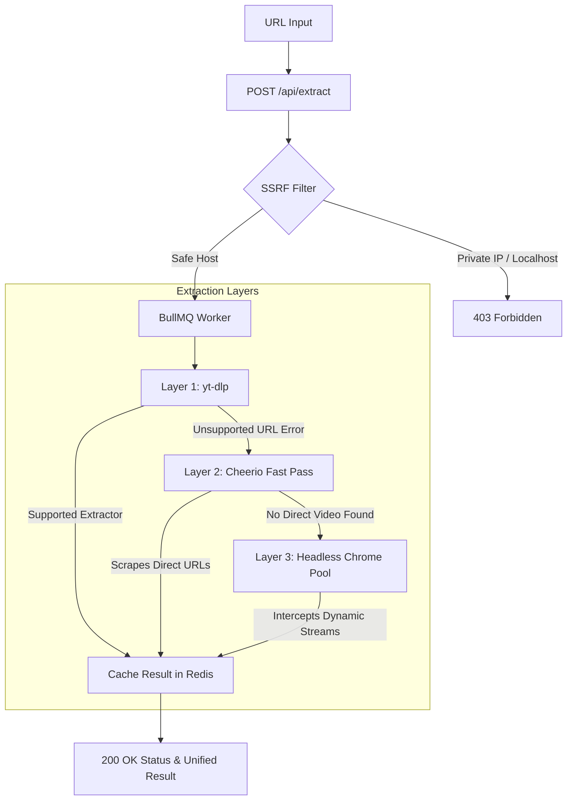

# Vidra - Universal Video Downloader System

Vidra is a production-grade universal video downloader system comprising:
1. **Backend**: Node.js + TypeScript service featuring a layered, hybrid extraction engine (`yt-dlp` with headless Puppeteer fallback + on-server FFmpeg merging for separate video/audio streams).
2. **App**: React Native CLI Android application implementing custom high-performance Glassmorphism UI tokens, background downloading, on-device HLS segment stitching, and security-aligned network handlers.

---

## Directory Structure

```text
Vidra/
├── backend/
│   ├── src/
│   │   ├── config/          # Constant tokens (SSRF blocks, Whitelists)
│   │   ├── middleware/      # SSRF filters and JWT verifiers
│   │   ├── extractors/      # yt-dlp processes and generic HTML/Puppeteer scrapers
│   │   ├── queue/           # BullMQ separate workers (yt-dlp, Puppeteer, FFmpeg merge)
│   │   ├── routes/          # Express controller endpoints
│   │   └── index.ts         # Bootstrapper entry point
│   ├── Dockerfile           # Debian slim runner package
│   ├── docker-compose.yml   # Multi-node API & Redis stack coordinator
│   ├── package.json
│   └── tsconfig.json
└── app/
    ├── src/
    │   ├── theme/           # Design system colors
    │   ├── components/      # Reusable GlassCards, spring buttons, custom dropdowns
    │   ├── store/           # Zustand state managers
    │   ├── api/             # Secure Axios client wrappers
    │   └── screens/         # Home, Results, Download Manager, Settings Screens
    ├── android/             # Android configurations (Manifests, ProGuard)
    ├── App.tsx              # Root component & custom navigator
    ├── package.json
    └── .env.example
```

---

## Backend Engine & Flow Architecture



### 1. Security Protocols Implemented
- **SSRF Shielding**: The backend resolves every requested hostname to its target IPs before initiating scrapers, blocking local loopbacks and private subnet CIDR classes (`127.0.0.0/8`, `10.0.0.0/8`, `172.16.0.0/12`, `192.168.0.0/16`, `169.254.0.0/16`).
- **Command Injection Prevention**: Underprocess `spawn` actions avoid string concatenation, using strict arrays for argument separation.
- **JWT Authorization**: Requests require standard `Bearer <token>` headers issued through device registrations.
- **Redis Rate Limiting**: The system implements `express-rate-limit` using `rate-limit-redis`, limiting queries dynamically by IP address and registered JWT Device ID.

---

## Setup & Running Guide

### Prerequisites
- Node.js (>= 18.0)
- Python 3 (installed and in system `PATH` for yt-dlp)
- FFmpeg and FFprobe (installed and in system `PATH` for stream merging)
- Redis server (or Docker daemon)

---

### Running the Backend

#### Option A: Quick Docker Compose Run (Recommended)
This launches Redis and the API Node app together inside a Debian container that manages system dependencies (Chromium, Python, FFmpeg, fonts).
```bash
cd backend
docker-compose up --build -d
```

#### Option B: Local Running Setup
1. **Configure Environment Variables**:
   Create a `.env` file in the `backend` directory matching `.env.example`:
   ```ini
   PORT=3000
   NODE_ENV=development
   REDIS_HOST=127.0.0.1
   REDIS_PORT=6379
   JWT_SECRET=development_vidra_jwt_secret_key_12345
   DOWNLOADS_DIR=./temp_downloads
   PUBLIC_HOST=http://localhost:3000
   ```
2. **Install Dependencies**:
   ```bash
   npm install
   ```
3. **Run Dev Mode**:
   ```bash
   npm run dev
   ```
   *Note: On startup, the server checks for the latest release of the `yt-dlp` executable. If it's missing from `backend/bin/`, it downloads it automatically.*

---

### Setting up the React Native App

1. **Install Dependencies**:
   ```bash
   cd app
   npm install
   ```
2. **Setup Server Target IP**:
   Open `app/src/api/client.ts` or set the host URL inside **Settings Screen** to point to your backend IP address (e.g. `http://10.0.2.2:3000/api` for the Android Emulator).
3. **Start React Native Metro Bundler**:
   ```bash
   npm start
   ```
4. **Compile & Run Android APK (Direct distribution release/debug)**:
   Ensure your Android device/emulator is connected:
   ```bash
   npm run android
   ```

---

## Key Features

1. **Auto-updating Scraper Binary**: The backend schedules a cron job running daily at 2:00 AM to fetch, download, and make executable the latest release of `yt-dlp` from its GitHub release assets.
2. **On-device HLS Stitching**: If a generic URL yields raw `.m3u8` manifests, the React Native app uses `ffmpeg-kit-react-native` to stitch segments on-device, saving server resources.
3. **Stateless Scale Workers**: The extraction queues (fast yt-dlp vs heavy Puppeteer browser passes) are decoupled via BullMQ and Redis, keeping workers stateless and horizontally scalable.
4. **Frosted Glassmorphism Theme**: Follows a cohesive design system using a soft Pearl Lavender (`#EBF0FF`) background, glass card surfaces with specular highlights, and active indicators filled with warm coral-electric teal gradients.
